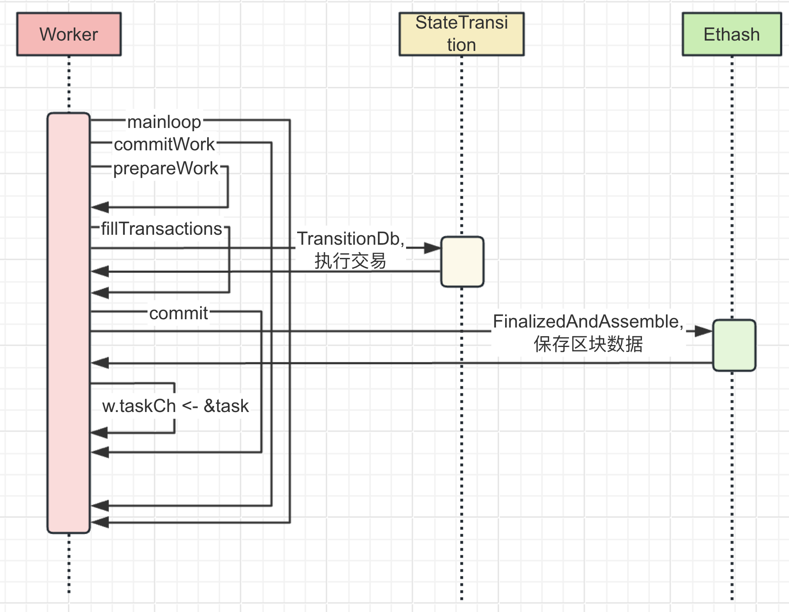
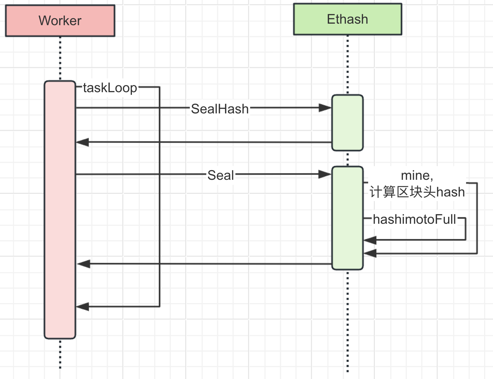

# go-ethereum 源码解读(一)：共识-工作量证明(PoW, Proof of Work)

## 前言

本系列分享共有 4 个分部工作量证明、权益证明、共识过程以及网络协议与通信。

本次主要讲解工作量证明的的原理以及源码实现。

## 基础介绍

区块链最早的共识机制，目的是为了保证区块链上数据的一致性，防止恶意攻击（比如 double spending 攻击、服务滥用）。

数据一致性包括账户余额、交易参数、交易顺序等。

以太坊中，由于最新版本已经废除工作量证明，并采用权益证明，本文中工作量证明展示的代码为 go-ethereum 的 1.11，仓库链接：[https://github.com/ethereum/go-ethereum/tree/release/1.11](https://github.com/ethereum/go-ethereum/tree/release/1.11)。

## 原理

工作量证明的主要作用是使用密码学哈希函数(以太坊中常用 SHA-256 算法计算哈希)生成**区块哈希**，矿工（以太坊中一个参与打包交易的以太坊节点）需要找到一个小于或等于**目标值**的哈希，这个目标值取决于**难度值**的大小。矿工通过不断修改区块头中的 **Nonce 值**，来改变计算得到的**结果值**大小。找到符合条件的哈希值后，矿工将新区块广播到网络，其他节点验证其有效性，并将其添加到区块链上。当新的区块被添加到区块链上，创建这个区块的矿工将会得到这个区块中所有交易消耗的 gas，所以工作量证明的计算过程又被称为“挖矿”，参与计算哈希的以太坊节点被称为矿工。

工作量证明通过这种高难度的计算防止恶意节点攻击和服务的滥用。

而挖矿获得激励的机制，天然的鼓励更多的人参与构建去中心化的以太坊网络共识。

## 工作量证明代码实现

以太坊会根据 CPU 核心数启动对应数量的 goroutine(Go 语言中，需要并行执行的计算，需要创建一个 goroutine)并发计算哈希，并且会使用随机数作为 nonce 的初始值，增加计算出哈希的效率：

代码源文件 go-ethereum/consensus/ethash/sealer.go：

```go
func (ethash *Ethash) Seal(chain consensus.ChainHeaderReader, block *types.Block, results chan<- *types.Block, stop <-chan struct{}) error {

        // 省略一些不重要的代码...
    
        // If we're running a shared PoW, delegate sealing to it
        if ethash.shared != nil {
                return ethash.shared.Seal(chain, block, results, stop)
        }
        
    // 省略一些不重要的代码...
    
        for i := 0; i < threads; i++ {
                pend.Add(1)
                go func(id int, nonce uint64) {
                        defer pend.Done()
                        ethash.mine(block, id, nonce, abort, locals)
                }(i, uint64(ethash.rand.Int63()))
        }
        
    // 省略一些不重要的代码...

        return nil
}
```

每个 goroutine 都会循环查找匹配要求的 nonce：

```go
func (ethash *Ethash) mine(block *types.Block, id int, seed uint64, abort chan struct{}, found chan *types.Block) {
        // Extract some data from the header
        var (
                header  = block.Header()
                hash    = ethash.SealHash(header).Bytes()
                // 目标值 = 2 ^ 256 / 难度值，即难度值越大， 目标值越小
                target  = new(big.Int).Div(two256, header.Difficulty)
                number  = header.Number.Uint64()
                dataset = ethash.dataset(number, false)
        )
        // Start generating random nonces until we abort or find a good one
        var (
                attempts  = int64(0)
                // seed是个随机数，会作为nonce的初始值来计算结果值
                nonce     = seed
                powBuffer = new(big.Int)
        )
        logger := ethash.config.Log.New("miner", id)
        logger.Trace("Started ethash search for new nonces", "seed", seed)
search:
        for {
                select {
                case <-abort:
                        // 省略一些不重要的代码...

                default:
                        // 省略一些不重要的代码...

                        // 计算结果值
                        digest, result := hashimotoFull(dataset.dataset, hash, nonce)
                        // 由于这个结果值也是一个哈希，可以理解为是一个符合条件的结果值均匀散列在 0 ~ 目标值之间
                        // 目标值越小，符合条件的结果值的范围就越小，计算出结果的概率就越小
                        if powBuffer.SetBytes(result).Cmp(target) <= 0 {
                                // 结果值 <= 目标值
                                // 找到了正确的nonce，赋值给区块头中对应的属性
                                header = types.CopyHeader(header)
                                header.Nonce = types.EncodeNonce(nonce)
                                header.MixDigest = common.BytesToHash(digest)

                                break search
                        }
                        nonce++
                }
        }
        // 省略一些不重要的代码...
}
```

计算当前区块的难度值：

代码源文件：go-ethereum/consensus/ethash/consensus.go

```go
// 以太坊不同版本的难度计算，唯一不同的地方在于声明不同的区块高度
// 这个区块高度会影响难度变化的周期，影响出块的速度
calcDifficultyEip5133 = makeDifficultyCalculator(big.NewInt(11_400_000))
calcDifficultyEip4345 = makeDifficultyCalculator(big.NewInt(10_700_000))
calcDifficultyEip3554 = makeDifficultyCalculator(big.NewInt(9700000))
calcDifficultyEip2384 = makeDifficultyCalculator(big.NewInt(9000000))
calcDifficultyConstantinople = makeDifficultyCalculator(big.NewInt(5000000))
calcDifficultyByzantium = makeDifficultyCalculator(big.NewInt(3000000))

func CalcDifficulty(config *params.ChainConfig, time uint64, parent *types.Header) *big.Int {
        next := new(big.Int).Add(parent.Number, big1)
        switch {
        case config.IsGrayGlacier(next):
                return calcDifficultyEip5133(time, parent)
        case config.IsArrowGlacier(next):
                return calcDifficultyEip4345(time, parent)
        case config.IsLondon(next):
                return calcDifficultyEip3554(time, parent)
        case config.IsMuirGlacier(next):
                return calcDifficultyEip2384(time, parent)
        case config.IsConstantinople(next):
                return calcDifficultyConstantinople(time, parent)
        case config.IsByzantium(next):
                return calcDifficultyByzantium(time, parent)
        case config.IsHomestead(next):
                return calcDifficultyHomestead(time, parent)
        default:
                return calcDifficultyFrontier(time, parent)
        }
}
```

## 工作量证明，矿工如何获得收益？

在以太坊启动的参数中有一个专门设置收益地址的参数，叫做 `miner.etherbase`。

当本地以太坊执行层节点创建一个新区块时，会把这个参数设置为 coinbase 地址，在执行交易时把交易中剩余的 gas 作为奖励，直接添加到 coinbase 地址余额：

打包区块前，worker 会把当前的 coinbase 赋值给 generateParams，而 generateParams 中的 coinbase 属性会被新的区块头读取到：

代码源文件：go-ethereum/miner/worker.go

```go
// 设置Header中coinbase地址的值
func (w *worker) commitWork(interrupt *int32, noempty bool, timestamp int64) {
        // 省略不重要的代码...
        if w.isRunning() {
                if w.coinbase == (common.Address{}) {
                        log.Error("Refusing to mine without etherbase")
                        return
                }
                // 获取当前worker中预设的coinbase地址
                coinbase = w.coinbase
        }
        // 在这个prepareWork中，新创建的Header会使用generateParams中的coinbase地址
        work, err := w.prepareWork(&generateParams{
                timestamp: uint64(timestamp),
                // coinbase属性赋值
                coinbase:  coinbase,
        })
        
        if !noempty && atomic.LoadUint32(&w.noempty) == 0 {
                w.commit(work.copy(), nil, false, start)
        }

        // 在fillTransactions中会真正的执行交易，而在交易执行完之后
        // 会将交易使用的gas，添加到coinbase地址余额
        err = w.fillTransactions(interrupt, work)
        if errors.Is(err, errBlockInterruptedByNewHead) {
                work.discard()
                return
        }
        w.commit(work.copy(), w.fullTaskHook, true, start)

    // 省略不重要的代码...
}
```

在真正执行交易之前，会先取 worker 中预设的 coinbase 地址。

并赋值给新创建的 generateParams，执行 prepareWork 方法时，新创建的 Header 会使用这个 generateParams 中的 coinbase 地址，作为 Header 的 coinbase 地址。

执行交易时，会在引用 Header 中的 coinbase 地址。

交易执行时，给 coinbase 发放奖励：

代码源文件：go-ethereum/core/state_transition.go

```go
func (st *StateTransition) TransitionDb() (*ExecutionResult, error) {
        
    // 省略不重要的代码...
        if st.evm.Config.NoBaseFee && msg.GasFeeCap.Sign() == 0 && msg.GasTipCap.Sign() == 0 {
                // 省略部分注释
        } else {
                // 每笔交易消耗的gas都会作为奖励发给coinbase地址
                // 并且不会因为交易执行过程中的错误而回滚
                // st.gasUsed() 就是在获取当前交易执行所消耗的gas
                fee := new(big.Int).SetUint64(st.gasUsed())
                // 这个effectiveTip一开始是gasPrice，
                // 在london硬分叉升级之后,会在GasTipCap和 (GasFeeCap - header.BaseFee)之间选最小的
                fee.Mul(fee, effectiveTip)
                // st.evm.Context.Coinbase就是Header的coinbase地址
                st.state.AddBalance(st.evm.Context.Coinbase, fee)
        }

        return &ExecutionResult{
                UsedGas:    st.gasUsed(),
                Err:        vmerr,
                ReturnData: ret,
        }, nil
}
```

执行交易之后，交易所消耗的 Gas 都会先乘以一个 GasPrice 系数，然后添加到 Header 的 Coinbase 地址的余额。

注：交易在执行 st.evm.Call 方法之后，即使交易执行失败，gas 也必定会被消耗。

## 交易执行与工作量证明计算时序图

Work 主循环中打包区块时序图



区块执行完之后，会为需要计算 Hash 的区块创建一个 task 并添加到 Worker 的 taskCh 中等待被处理。

Worker 的 taskLoop 中处理 taskCh 中的 task 时序图



taskLoop 中，使用 SealHash 方法对 task 任务中的区块信息生成一个 Hash，并缓存到内存中，防止需要生成哈希的区块被重复提交。

之后再调用 Seal 方法，计算区块头中的 nonce，真正的开始挖矿计算。
