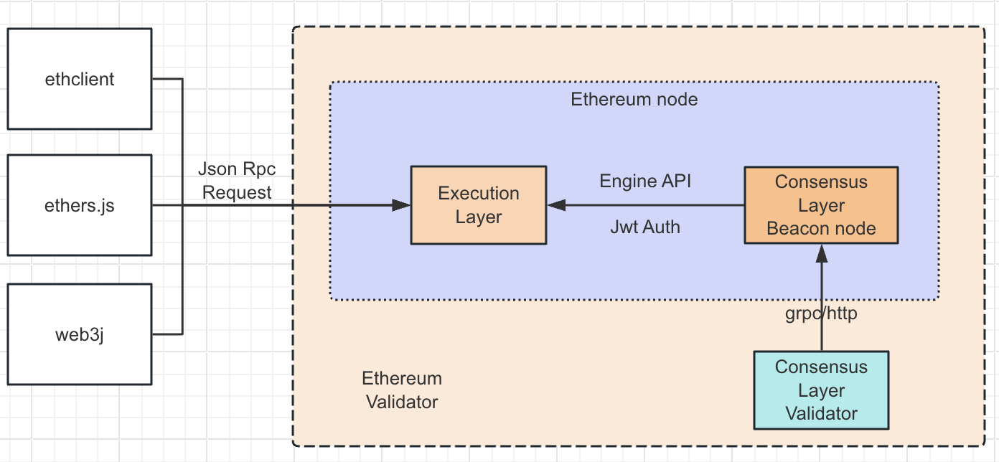
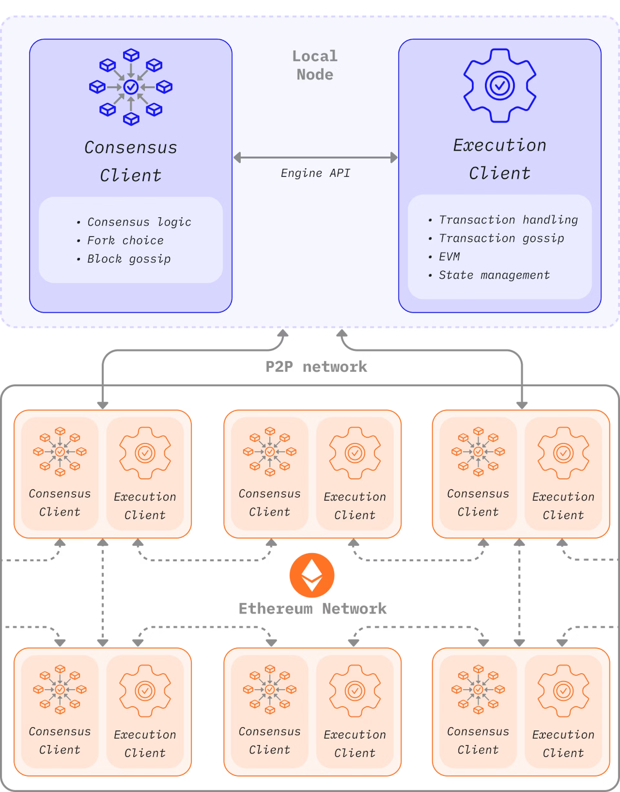
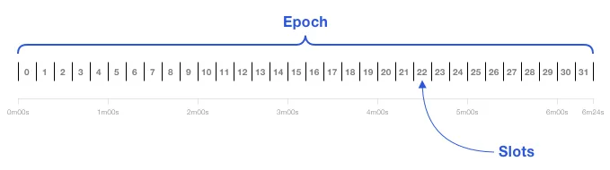
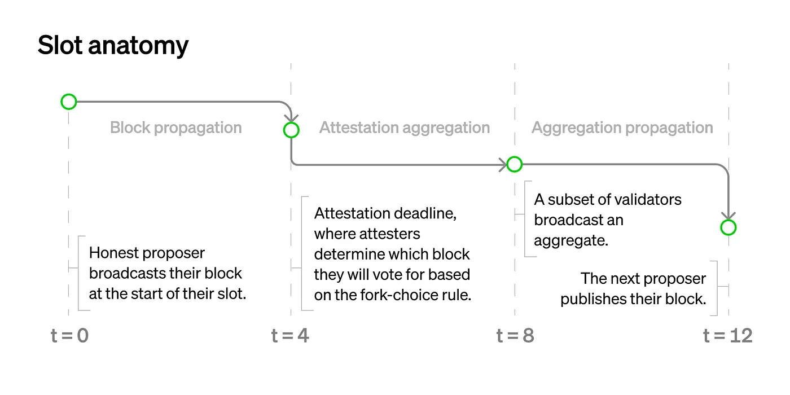

# 区块链技术原理（二）共识机制基础-权益证明（Proof of Stake, PoS）

## 权益证明的定义

权益证明是一种加密货币的共识机制，需要验证者将有价值的东西存放的到网络中，当验证者行为不诚实时，这些有价值的东西会被销毁。

在以太坊网络中，这个有价值的东西就是 ETH，验证者需要把 ETH 质押到提前部署到链上的特定的某个合约中以获得成为验证者的资格。当验证者尝试欺骗网络（比如它应该提交一个区块时却提议多个区块，或者发送相互冲突的证明），它质押的 ETH 会被销毁一部分或者全部。

## 成为验证者

想成为一个验证者，用户必须要质押 32 个 ETH 到质押合约，并且运行 3 个服务: 执行层客户端(EL, Execution Layer)、共识层客户端(CL, Consensus Layer)、验证者客户端(Validator)。

以太坊已经在链上提前部署了一个质押合约，这个合约地址和代码是公开的，可以在以太坊 spec 仓库([https://github.com/ethereum/consensus-specs/blob/dev/solidity_deposit_contract/deposit_contract.sol](https://github.com/ethereum/consensus-specs/blob/dev/solidity_deposit_contract/deposit_contract.sol))中查看。

目前仅提供了 deposit 方法，也就是说这个合约只能接收资金。

合约经过验证之后，会发送一个合约事件，这个事件会被当前区块包含。验证者客户端会读取区块中包含的充值事件，重新包装后交给存档到一个 pendingDeposits 的队列中，当新的提议者出块时，会读取这个队列中的 deposit 事件，然后创建一个 Validator 结构体，保存余额、公钥等基本信息，**验证者的信息仅记录在 BeaconChain 上**。

质押合约一次充值金额最少为 1 ETH，并且不能转成 Gwei 后不能存在小数位。

验证者可以多次充值，次数不限。

当用户质押的 ETH 数量达到 32 个时，会被添加到激活队列中，这个队列专门是为了限制一个新的验证者被添加到网络中的几率，保证网络的稳定。

一旦激活，验证者将会从 P2P 网络收到新的区块。

当验证者想要退出并提现时，在共识层客户端通知执行层客户端生成区块时，使用 withdrawals 字段传递提现信息，并直接添加到账户的余额，这种方式不会消耗 gas。

## 权益证明的区块生成过程

### Slot 与 Epoch

每 12 秒为一个 Slot，在一个 Slot 中，验证者提议和验证区块，保证区块以一定的频率被创建和添加到链上，并且在同一个 Slot 中，验证者只有一种角色。

在一个 Epoch 中，包含 32 个 Slot，代表权益证明机制中一个完整的回合。

所有的验证者会被平均分配到各个 Slot，且一个验证者在一个 Epoch 中会被分配到 1 个 Slot 中，每个 Slot 中所有的验证者组中一个委员会。

在一个 Slot 中，验证者会被分为两种角色，分别是提议者(Proposer)和见证者(Attester)。

提议者：只有一个，并需要在 4 秒内广播提议的区块。

见证者：一个 Slot 中没有被选为提议者的验证者都是见证者，投票证明提议者广播的区块为最新的区块。

一个 Slot 中，时间被分为 3 个阶段：

1. 提议区块：提议者产生一个新区块，并且在 Slot 的前 4 秒广播这个区块给委员会中其他的见证者。
2. 聚合证明：见证者投票这个新区块是否被接受。如果在证明截止时间之前，没有收到新的区块的广播，他们将投票支持之前接受的 Head 区块。
3. 广播投票：在最后 4 秒里，所有委员会成员广播投票结果，并发给下一个 slot 的提议者。

也就是说，提议者越早把区块广播出去，那么收到区块的见证者越多，聚合证明这个新区块就越多。

### 执行交易

1. 用户使用私钥创建一个被签名过的交易，通过 JSON RPC Request 发送给 EL。
2. EL 收到交易后，验证交易的有效性，比如检查 sender 账户余额是否有足够的 ETH 和交易的签名信息。
3. 如果交易有效，则把交易保存到本地的 mempool，并通过 EL 的 gossip 网络发送给其他的 EL 节点，其他的 EL 节点收到交易后也会把交易保存到自己的 mempool 中。
4. 当前 Slot 中的一个验证者被随机选择成为提议者，向本地的 CL 节点发送一个生成区块的请求，CL 收到后，使用 Engine API 向 EL 节点发送请求，调用 ForkChoiceUpdated 方法。EL 从 mempool 中取出交易执行，并生成 ExecutionPayload 信息后，返回 PayloadId，这个 PayloadId 最终返回给提议者，提议者再使用 PayloadId 向 CL 查询，CL 向 EL 查询，最后返回 ExecutionPayload，经过 CL 处理，在经过提议者处理并广播出去
5. 其他 CL 节点通过 gossip 网络收到新的信标区块(Beacon Block)数据。然后发送 ExecutionPayload 数据给 EL，EL 执行其中的交易后并验证状态有效后，见证者投票证明区块有效性后，将区块保存到本地数据库。
6. 交易在经过两个检查点后，将被确认为 finalized 状态。检查点只会是 epoch 的第一个 slot。所以经过两个检查点就必须是交易经过了一个完整的 epoch 和下一个 epoch 的首个 slot 区块的确认。

## 常见 QA

#### PoS 的机制是否依赖 PoW 的发展，没有 PoW 存在是否可以直接诞生 PoS?

PoW 是在 1993 年首次由 Cynthia Dwork 和 Moni Naor 在学术论文中提出。首次应用是在 2009 年，于比特币网络中使用。

PoS 则是在 2012 年提出并且投入使用，由于 PoS 的需要解决的问题就是比特币网络计算能耗过高，所以 PoS 的出现肯定是依赖于 PoW 的。

#### Level0 任务 5 中提到 PoS 机制要求每个验证者需要质押 32 ETH ，那这个 32 个 ETH 从何而来呢?

一般是先在中心化的交易所购买 USDT 然后使用 USDT 换取足够数量的 ETH 后，提现到主网。

#### “开采区块” 跟 “验证者” 是什么意思，两者之间的逻辑是什么?

由于 PoW 时期，生成新的区块的过程被称为挖矿。现在 PoS 只是延续了这个叫法。

PoS 中只有验证者才可以有资格生成区块。

#### 区块链上的参与者是不是每个人都有一个账本。那当有一个状态需要发生改变时，是链上的所有参与者都需要通知吗？这样的话如果参与者有几百几千万的话者效率也太低了吧?

是的，正因为这种传播效率低，所以目前多种不同的解决方案：

- 侧链，重新运行一套新的区块链网络。
- Layer2，即所有的业务不会直接直接在 L1 上提交，而是先提交到 L2 上，L2 上把数据'Rollup'之后统一提交到 L1 上，减少 L1 上的交易量。
- 升级基本协议，比如以太坊从 PoW 合并到 PoS、轻客户端、未来可能会投入应用的 sharding chain 等。
