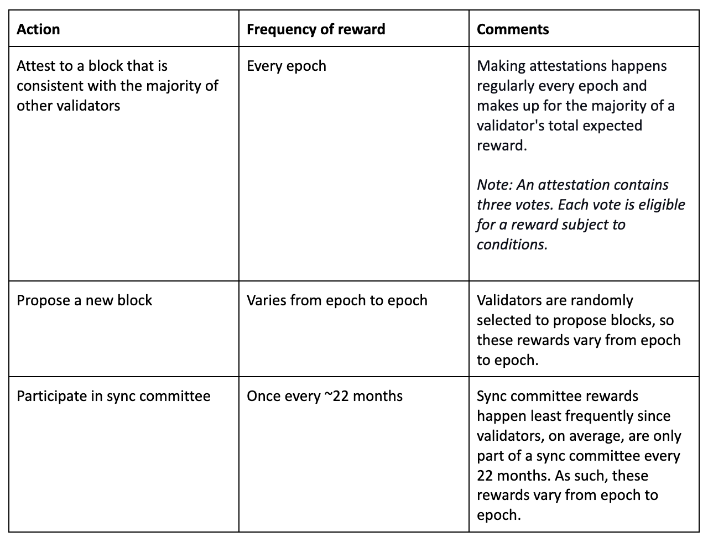
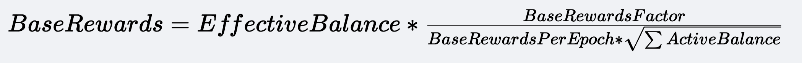
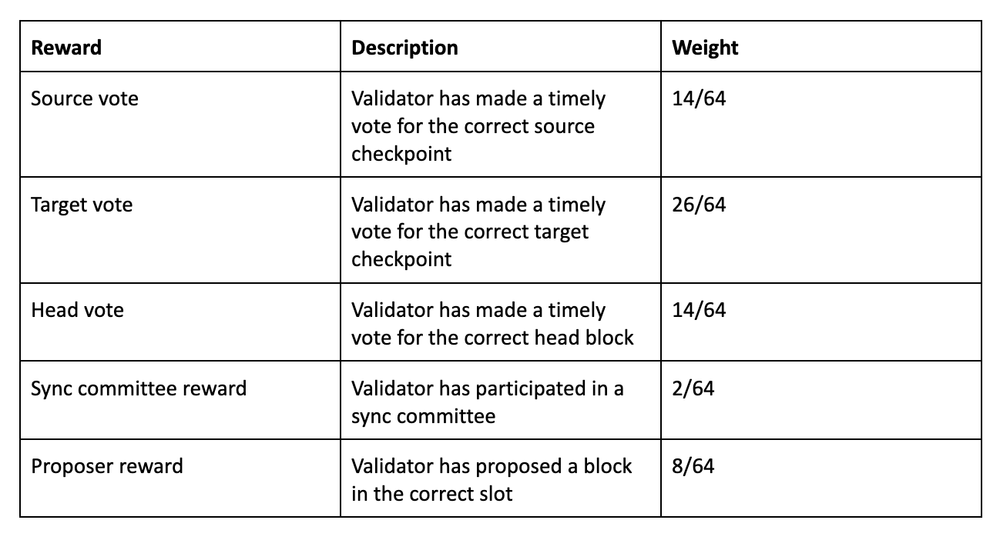

# 区块链技术原理（三）共识机制基础-权益证明（Proof of Stake，PoS）

以太坊在工作量证明时期，对于作恶矿工的惩罚是浪费矿工计算 Hash 所消耗的能源以及计算时间，这种惩罚对于作恶矿工的惩罚力度一般。

而以太坊的共识机制合并到权益证明之后，为了更好的打击作恶矿工，除了拉黑名单以外，还需要矿工质押一定的资产之后，才可以成为验证者，参与共识网络。当验证者作恶或者消极怠工时，都会被惩罚，减少奖励，甚至扣除质押的资产。

奖励与惩罚行为在每个 Epoch 中只会触发一次，因此验证者想要获得奖励，至少要从激活到退出这个时间段内，参与共识网络一个完整的 epoch 周期才可以获得。

## 验证者的余额

在以太坊的权益证明的共识机制中，定义了验证者的余额。

由于质押资产的特殊性，当前以太坊的 Beacon 链维护了验证者的两个单独的记录：

- **实际余额(Actual balance)**: 验证者实际持有资产的余额数值。包含了验证者存到合约中的金额、参与共识所获得的奖励、减去不活动的罚款。
- **有效余额(Effective balance)**: 有效余额是根据实际余额衍生出来的，并且被设计为一个 Epoch 变化一次，并且一整数个 ETH 计算(无小数)，在计算上更快。上限是 32ETH，因此验证者实际余额可能是 100ETH，但是有效余额只有 32ETH。

## 奖励分配

### 奖励行为



1. 验证区块，大部分奖励都是从这个渠道获取的
2. 提议创建一个区块，由于一个 Epoch 里面只有 32 个验证者会被选为提议者，所以这种方式获取的奖励非常稀少。
3. 参与同步委员会奖励，每 256 个 Epoch(27.3 个小时)会选出 512 个验证者参与同步委员会，目前估算时至少需要 22 个月才能获得一次奖励。

### 奖励计算

验证者计算的奖励金额是基于“基本奖励”参数得到的：



- 基本奖励系数为 64
- 每个周期基本奖励是 4
- sum(活跃余额)是当期那所有活跃验证者的**有效余额总额**

所以有效余额越大，基础奖励越高。

当参与共识的验证者越多，活跃余额总数也越高，基础奖励也会减少。



### 奖励接收

所有的奖励会被记录在 Beacon 链上，当有奖励发放时，在提议者提议新区块时，会构建一个最多包含 16 个提现请求的队列，根据协议规则判断账户是否有合格的提款，有就添加到队列。如果超过长度，下一个提议者会从上次中断的地方继续，按照顺序安排提现。

这个提现方式并不是按照执行交易的方式执行，与 PoW 发放奖励的机制类似，是在执行层 Finalize 区块的时候直接把提现金额添加到账户地址的余额上。不需要额外的 gas。

由于这种发放方式是每个区块只会处理 16 个地址，因此奖励发放较慢，现在至少 1 周才可以收到奖励。

奖励的方法方式与验证者提现方式一致，**在共识层客户端通知执行层客户端生成区块时，使用 withdrawals 字段传递提现信息，并直接添加到账户的余额，这种方式不会消耗 gas。**

## 欺诈惩罚

目前惩罚主要针对的是证明者和参与同步委员会中的验证者。

### 提议者惩罚

目前区块的提议者没有明确的惩罚。如果区块提议者未能提出区块，或者区块无效，在那个 slot 中会出一个空块，然后开始下一个 slot。

**个人理解**：提议者的没有明确惩罚的原因

1. 是其恶意行为不能被明显的感知到
2. 每个验证者成为提议者的概率很低

### 认证惩罚(Attestation Panaltise)

证明缺失、迟交、不正确均会收到惩罚。

不活跃的惩罚会随着时间推移成倍增加，减少不活跃的验证者在网络中的权益，让他们控制的总权益占比少于 1/3。

惩金与能够获得的奖励相同。

### 同步委员会惩罚(Sync committee Penalties)

同步委员会验证者会在签署的每个 Slot 中签署正确的 Head 区块都会获得奖励。

没有参与但是参加了同步委员会的验证者会受到惩罚。

罚金与奖励金额相同。

## 代码

```go
func ProcessRewardsAndPenaltiesPrecompute(
    beaconState state.BeaconState,
    bal *precompute.Balance,
    vals []*precompute.Validator,
) (state.BeaconState, error) {

    // 省略不重要的代码

    attDeltas, err := AttestationsDelta(beaconState, bal, vals)
    if err != nil {
       return nil, errors.Wrap(err, "could not get attestation delta")
    }

    balances := beaconState.Balances()
    for i := 0; i < numOfVals; i++ {
       vals[i].BeforeEpochTransitionBalance = balances[i]

       // Compute the post balance of the validator after accounting for the
       // attester and proposer rewards and penalties.
       delta := attDeltas[i]
       balances[i], err = helpers.IncreaseBalanceWithVal(balances[i], delta.HeadReward+delta.SourceReward+delta.TargetReward)
       if err != nil {
          return nil, err
       }
       balances[i] = helpers.DecreaseBalanceWithVal(balances[i], delta.SourcePenalty+delta.TargetPenalty+delta.InactivityPenalty)

       vals[i].AfterEpochTransitionBalance = balances[i]
    }

    if err := beaconState.SetBalances(balances); err != nil {
       return nil, errors.Wrap(err, "could not set validator balances")
    }

    return beaconState, nil
}
```

实际处理奖励和惩罚的时候，是从 beaconState.Balances()读取的，这个方法返回的余额是验证者的实际余额，**奖励与惩罚是在实际余额的数值上加减**，会直接影响退出验证者时，能够收到的金额。

## QA 环节
