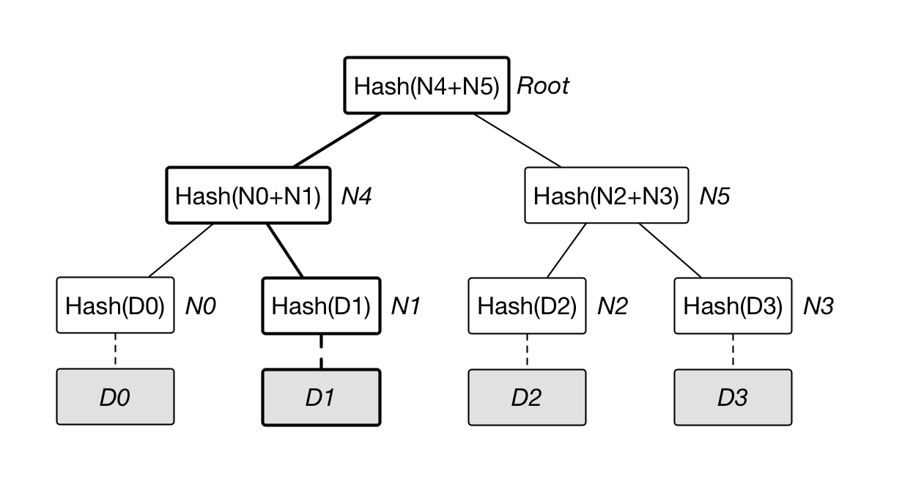
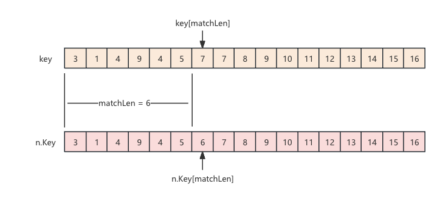

# 区块链技术原理 默克尔树与 MPT 树

## 默克尔树简单介绍

默克尔树，也被称为哈希树，它的是一种特殊的二叉树结构。

它的叶子节点一般是保存实际数据或者实际数据的哈希值，而非叶子节点包含其子节点的哈希值。根节点的哈希值代表整个默克尔树的哈希值。

通过递归地方式计算和验证数据的哈希值，默克尔树可以高效地检测和验证数据的完整性和一致性。

### 默克尔树的结构



**叶子节点（Leaf Nodes） **叶子节点存储数据块的哈希值。假设有四个数据块 D0、D1、D2、D3，则叶子节点存储的是哈希值 H(D0) = N0、H(D1) = N1、H(D2) = N2、H(D3) = N3。

**非叶子节点（Non-leaf Nodes） **非叶子节点存储其子节点哈希值的哈希。例如，非叶子节点存储 H(N0 + N1) = N4 和 H(N2 + N3) = N5。

**根节点（Root Node） **根节点存储整个树的哈希值，称为默克尔根（Merkle Root），它是树的顶层节点 H(N4 + N5) = Root。

### 默克尔树哈希的计算过程

1. 对所有叶子节点对应的数据块进行哈希运算，得到叶子节点的哈希值。假设为 H(A)、H(B)、H(C)、H(D)。
2. 递归地将叶子节点的哈希值两两组合，并计算其哈希值，形成上一层的非叶子节点。假设为 H(H(A) + H(B))，H(H(C) + H(D))。
3. 继续递归计算，直到生成根节点哈希值，即默克尔根。假设为 H(H(H(A) + H(B)) + H(H(C) + H(D)))。

### 默克尔树的验证机制

**数据块验证**

若需验证某个数据块是否包含在默克尔树中，验证者只需检查从该叶子节点到根节点的哈希路径，而无需检查整个数据集。

**证明路径（Proof Path）**

验证者通过获取验证路径上的所有相关哈希值，可以快速验证数据块的完整性。例如，要验证数据块 A，需检查哈希值 H(A)、H(B)以及它们的父节点哈希值 H(H(A) + H(B))。

**验证过程**

验证者通过计算从叶子节点到根节点的哈希值，并将结果与默克尔根比较。如果计算结果与默克尔根一致，则数据块未被篡改。

### 默克尔树缺点

**叶子节点数量限制**

默克尔树的构建依赖于叶子节点数量的偶数性，如果叶子节点数量为奇数，需复制最后一个叶子节点的哈希值来凑成偶数。

**树的平衡性**

默克尔树的构建需要保持树的平衡性，以确保验证路径的长度最短。

## **MPT 树(Merkle Patricia Trie)**

MPT 树结合了默克尔树和帕特里夏树的特点，用于高效存储和检索数据，并能够进行复杂状态的快速验证。MPT 树是以太坊中状态和交易的核心数据结构。

可以看作是传统默克尔树的升级版。

以太坊中，状态树、交易树、收据树都是使用 MPT 树存储的。

实现 MPT 树的具体代码：[https://github.com/ethereum/go-ethereum/trie/trie.go](https://github.com/ethereum/go-ethereum/trie/trie.go)

MPT 树在实现上比需要平衡树节点的传统默克尔树更加容易。

1. MPT 树不需要理会树的平衡，并且以 Key 为路径，分叉维护处理非常简单。
2. 不需要为每个不同的 Key 创建单独的节点，而是根据 Key 的路径合并与分叉，非叶子节点的数据压缩比更大。
3. 查找效率可能在极端情况下查找的层级比传统默克尔树更深，但是在加载节点的范围上更小。

### MPT 树的结构

```go
type (
    fullNode struct {
       Children [17]node // Actual trie node data to encode/decode (needs custom encoder)
       flags    nodeFlag
    }
    shortNode struct {
       Key   []byte
       Val   node
       flags nodeFlag
    }
    hashNode  []byte
    valueNode []byte
)
```

**FullNode **MPT 树独有的结构，其中包含一个长度为 17 的节点数组，包含 前 16 个位置存放子节点指针，最后一个位置保存可选的关联值。

**ValueNode **对应默克尔树种的叶子节点，存储实际数据的节点，被 FullNode 和 ShortNode 持有其引用，本身也不会单独作为节点存在。

**HashNode**：表示节点的哈希值,用于节省存储空间。当从数据库中加载时,使用哈希值来代替实际子节点值。

**ShortNode**：表示只有一个子节点的节点,用于压缩路径。

### MPT 树的操作

在对树做插入、查找、删除操作前，都需要对 key、value 提前处理。

key 需要提前转换成哈希：

```go
func (t *StateTrie) hashKey(key []byte) []byte {
    // 从hasherPool中获取hasher
    h := newHasher(false)
    h.sha.Reset()
    h.sha.Write(key)
    h.sha.Read(t.hashKeyBuf[:])
    returnHasherToPool(h)
    return t.hashKeyBuf[:]
}

// hasherPool holds pureHashers
// 由于计算哈希，需要频繁创建[]byte 有大有小，并且相当于一次性，对内存的使用率不高
// 这里使用对象池，缓存一部分hasher，减少创建开销，也同样减少频繁的垃圾回收
var hasherPool = sync.Pool{
    New: func() interface{} {
       return &hasher{
          tmp:    make([]byte, 0, 550), // cap is as large as a full fullNode.
          sha:    crypto.NewKeccakState(),
          encbuf: rlp.NewEncoderBuffer(nil),
       }
    },
}

func newHasher(parallel bool) *hasher {
    h := hasherPool.Get().(*hasher)
    h.parallel = parallel
    return h
}
```

为了内存的利用率，减少垃圾回收的开销，这里使用到的对象池缓存使用过的 hasher。

value 则需要提前进行 rlp 编码：

```go
// EncodeToBytes returns the RLP encoding of val.
// Please see package-level documentation for the encoding rules.
func EncodeToBytes(val interface{}) ([]byte, error) {
    buf := getEncBuffer()
    defer encBufferPool.Put(buf)

    if err := buf.encode(val); err != nil {
       return nil, err
    }
    return buf.makeBytes(), nil
}
```

用来编码 Buffer 也同样使用对象池保存使用过的 buffer。

#### **插入**

当需要插入新数据时，使用 Trie 公开的 Update 方法，value 的长度必须大于 0。

当 value 等于 0 时，则是删除数据。

```go
func (t *Trie) update(key, value []byte) error {
    t.unhashed++
    k := keybytesToHex(key)
    if len(value) != 0 {
       _, n, err := t.insert(t.root, nil, k, valueNode(value))
       if err != nil {
          return err
       }
       t.root = n
    } else {
       // 省略删除数据代码...
    }
    return nil
}
```

keyBytesToHex 方法的作用是把原本 8 位的 byte 拆分成高 4 位和低 4 位两个 byte，这样原本 Key 的 byte 数组长度会被扩展成原来的两倍，但是新的 byte 数组中的值都会是小于 16 的值，即范围是 0~15。

并且还会在这个新生成的 Key 的结尾额外在添加一个 byte 值为 16 的元素。

插入新键值对的过程

```go
func (t *Trie) insert(n node, prefix, key []byte, value node) (bool, node, error) {
    if len(key) == 0 {
       if v, ok := n.(valueNode); ok {
          return !bytes.Equal(v, value.(valueNode)), value, nil
       }
       return true, value, nil
    }
    switch n := n.(type) {
    case *shortNode:
       matchlen := prefixLen(key, n.Key)
       // If the whole key matches, keep this short node as is
       // and only update the value.
       if matchlen == len(n.Key) {
          dirty, nn, err := t.insert(n.Val, append(prefix, key[:matchlen]...), key[matchlen:], value)
          if !dirty || err != nil {
             return false, n, err
          }
          return true, &shortNode{n.Key, nn, t.newFlag()}, nil
       }
       // Otherwise branch out at the index where they differ.
       branch := &fullNode{flags: t.newFlag()}
       var err error
       _, branch.Children[n.Key[matchlen]], err = t.insert(nil, append(prefix, n.Key[:matchlen+1]...), n.Key[matchlen+1:], n.Val)
       if err != nil {
          return false, nil, err
       }
       _, branch.Children[key[matchlen]], err = t.insert(nil, append(prefix, key[:matchlen+1]...), key[matchlen+1:], value)
       if err != nil {
          return false, nil, err
       }
       // Replace this shortNode with the branch if it occurs at index 0.
       if matchlen == 0 {
          return true, branch, nil
       }
       // New branch node is created as a child of the original short node.
       // Track the newly inserted node in the tracer. The node identifier
       // passed is the path from the root node.
       t.tracer.onInsert(append(prefix, key[:matchlen]...))

       // Replace it with a short node leading up to the branch.
       return true, &shortNode{key[:matchlen], branch, t.newFlag()}, nil

    case *fullNode:
       dirty, nn, err := t.insert(n.Children[key[0]], append(prefix, key[0]), key[1:], value)
       if !dirty || err != nil {
          return false, n, err
       }
       n = n.copy()
       n.flags = t.newFlag()
       n.Children[key[0]] = nn
       return true, n, nil

    case nil:
       // New short node is created and track it in the tracer. The node identifier
       // passed is the path from the root node. Note the valueNode won't be tracked
       // since it's always embedded in its parent.
       t.tracer.onInsert(prefix)

       return true, &shortNode{key, value, t.newFlag()}, nil

    // 省略不重要的代码...

    default:
       panic(fmt.Sprintf("%T: invalid node: %v", n, n))
    }
}
```

新值插入时，只会产生两种类型的 Node，分别是 ShortNode 和 FullNode。

当插入新数据时，需要提供当前的 Root 节点，当 Trie 为空树，Root 节点是 nil。

当 Trie 为空树或者插入都最后一层叶子节点是，会进入 `case nil`，会把当前传进来的 value 封装成 shortNode，并返回。

把参数 n 理解为当前节点。

##### n 是 shortNode 类型时

先检查新插入的 key 与 n.Key 的匹配长度。

当匹配长度等于 `len(n.Key)` 时，就是 key 与 n.Key 相同，那么直接替换 Val。



当 key 与 n.Key 没有完全匹配时，也就是匹配长度会小于当前 Key 的长度，需要在当前节点分叉，创建一个新的 FullNode，分别在 FullNode 的 Children 数组的 key[matchLen]和 n.Key[matchLen]两个位置分别插入 value 和 n.Val。

需要处理一种特殊情况，即 matchLen == 0 时，两个 key 当前没有任何重合的部分，直接返回新创建的 FullNode 节点。

有重合部分时，创建一个新的 ShortNode，新的 shortNode 的 key 是重合部分 key[:matchLen]，Val 是刚刚新创建的 FullNode。

##### n 是 FullNode 时

以 n.Children 数组的 key[0]位置的子节点作为参数，重新截取 key，插入 value。

递归处理插入流程。

最后更新 n.Children 数组的 key[0]位置子节点引用。

#### **查找**

根据键查找值的过程

```go
func (t *Trie) Get(key []byte) ([]byte, error) {
    // Short circuit if the trie is already committed and not usable.
    if t.committed {
       return nil, ErrCommitted
    }
    value, newroot, didResolve, err := t.get(t.root, keybytesToHex(key), 0)
    if err == nil && didResolve {
       t.root = newroot
    }
    return value, err
}

func (t *Trie) get(origNode node, key []byte, pos int) (value []byte, newnode node, didResolve bool, err error) {
    switch n := (origNode).(type) {
    case nil:
       return nil, nil, false, nil
    case valueNode:
       return n, n, false, nil
    case *shortNode:
       if len(key)-pos < len(n.Key) || !bytes.Equal(n.Key, key[pos:pos+len(n.Key)]) {
          // key not found in trie
          return nil, n, false, nil
       }
       value, newnode, didResolve, err = t.get(n.Val, key, pos+len(n.Key))
       if err == nil && didResolve {
          n = n.copy()
          n.Val = newnode
       }
       return value, n, didResolve, err
    case *fullNode:
       value, newnode, didResolve, err = t.get(n.Children[key[pos]], key, pos+1)
       if err == nil && didResolve {
          n = n.copy()
          n.Children[key[pos]] = newnode
       }
       return value, n, didResolve, err
    case hashNode:
       child, err := t.resolveAndTrack(n, key[:pos])
       if err != nil {
          return nil, n, true, err
       }
       value, newnode, _, err := t.get(child, key, pos)
       return value, newnode, true, err
    default:
       panic(fmt.Sprintf("%T: invalid node: %v", origNode, origNode))
    }
}
```

查询过程则是以 key 作为路径，逐段遍历 key 数组中元素匹配的过程，当遍历完了 key 中所有元素，就找到了最终的存储数据的 ValueNode。

#### **删除**

删除键值对的过程。

```go
func (t *Trie) update(key, value []byte) error {
    t.unhashed++
    k := keybytesToHex(key)
    if len(value) != 0 {
       // 省略插入数据代码...
    } else {
        _, n, err := t.delete(t.root, nil, k)
        if err != nil {
            return err
        }
        t.root = n
    }
    return nil
}

func (t *Trie) delete(n node, prefix, key []byte) (bool, node, error) {
    switch n := n.(type) {
    case *shortNode:
       matchlen := prefixLen(key, n.Key)
       if matchlen < len(n.Key) {
          return false, n, nil // don't replace n on mismatch
       }
       if matchlen == len(key) {
          // The matched short node is deleted entirely and track
          // it in the deletion set. The same the valueNode doesn't
          // need to be tracked at all since it's always embedded.
          t.tracer.onDelete(prefix)

          return true, nil, nil // remove n entirely for whole matches
       }
       // The key is longer than n.Key. Remove the remaining suffix
       // from the subtrie. Child can never be nil here since the
       // subtrie must contain at least two other values with keys
       // longer than n.Key.
       dirty, child, err := t.delete(n.Val, append(prefix, key[:len(n.Key)]...), key[len(n.Key):])
       if !dirty || err != nil {
          return false, n, err
       }
       switch child := child.(type) {
       case *shortNode:
          // The child shortNode is merged into its parent, track
          // is deleted as well.
          t.tracer.onDelete(append(prefix, n.Key...))

          // Deleting from the subtrie reduced it to another
          // short node. Merge the nodes to avoid creating a
          // shortNode{..., shortNode{...}}. Use concat (which
          // always creates a new slice) instead of append to
          // avoid modifying n.Key since it might be shared with
          // other nodes.
          return true, &shortNode{concat(n.Key, child.Key...), child.Val, t.newFlag()}, nil
       default:
          return true, &shortNode{n.Key, child, t.newFlag()}, nil
       }

    case *fullNode:
       dirty, nn, err := t.delete(n.Children[key[0]], append(prefix, key[0]), key[1:])
       if !dirty || err != nil {
          return false, n, err
       }
       n = n.copy()
       n.flags = t.newFlag()
       n.Children[key[0]] = nn

       // Because n is a full node, it must've contained at least two children
       // before the delete operation. If the new child value is non-nil, n still
       // has at least two children after the deletion, and cannot be reduced to
       // a short node.
       if nn != nil {
          return true, n, nil
       }
       // Reduction:
       // Check how many non-nil entries are left after deleting and
       // reduce the full node to a short node if only one entry is
       // left. Since n must've contained at least two children
       // before deletion (otherwise it would not be a full node) n
       // can never be reduced to nil.
       //
       // When the loop is done, pos contains the index of the single
       // value that is left in n or -2 if n contains at least two
       // values.
       pos := -1
       for i, cld := range &n.Children {
          if cld != nil {
             if pos == -1 {
                pos = i
             } else {
                pos = -2
                break
             }
          }
       }
       if pos >= 0 {
          if pos != 16 {
             // If the remaining entry is a short node, it replaces
             // n and its key gets the missing nibble tacked to the
             // front. This avoids creating an invalid
             // shortNode{..., shortNode{...}}.  Since the entry
             // might not be loaded yet, resolve it just for this
             // check.
             cnode, err := t.resolve(n.Children[pos], append(prefix, byte(pos)))
             if err != nil {
                return false, nil, err
             }
             if cnode, ok := cnode.(*shortNode); ok {
                // Replace the entire full node with the short node.
                // Mark the original short node as deleted since the
                // value is embedded into the parent now.
                t.tracer.onDelete(append(prefix, byte(pos)))

                k := append([]byte{byte(pos)}, cnode.Key...)
                return true, &shortNode{k, cnode.Val, t.newFlag()}, nil
             }
          }
          // Otherwise, n is replaced by a one-nibble short node
          // containing the child.
          return true, &shortNode{[]byte{byte(pos)}, n.Children[pos], t.newFlag()}, nil
       }
       // n still contains at least two values and cannot be reduced.
       return true, n, nil

    case valueNode:
       return true, nil, nil

    case nil:
       return false, nil, nil

    case hashNode:
       // 省略一些不重要的代码...
    }
}
```

删除 shortNode 时，有两种情况：

这种情况就是 `matchlen == len(key)`，即需要删除的 key 完全匹配当前的 ShortNode 的 key，直接返回 nil，即删除当前节点。

当 metchlen != key 时，意味着 key 更长，在重新截取 key 后到更深一层匹配。

当 n 的类型是 FullNode，递归进入 n.Children 数组的 key[0]下标位置的子节点进行删除操作。

删除完成之后，如果返回的节点是否为空，还需要遍历检查 n 的 Children 数组中的非 nil 元素数量是否足够。

因为节点是被逐个删除，不会批量被删除，所以 FullNode 中的 nil 元素数量不会立刻变为 17 个，所以 pos 不会再循环后还是-1。当 children 找到第二个非 nil 元素，pos 被赋值为-2，并中断 for 循环，停止检查直接返回。

pos 是正数时，意味着 for 循环只找到了一个非 nil 元素，需要将当前的 FullNode 转成 shortNode。

当 `pos != 16` 时，需要确认这个子节点是否是 hashNode，如果是 hashNode，需要使用 hashNode 把完整的子节点加载出来之后，判断子节点是否 shortNode。是 shortNode 类型，拼接好 key 之后，创建新的 shortNode 返回。如果是 FullNode 类型，那么包装成新的 shortNode 返回。

#### 解析 HashNode

Trie 在重新使用 RootHash 加载数据时，不会一次性把所有数据加载出来，而是一个 HashNode 的形式被 Root 节点引用。

当操作 Trie 时所使用的 key 所在的路径碰到 HashNode，这个时候才会使用 HashNode 的 hash 从底层数据库中把这个节点的数据读取出来。

具体的读取过程。

```go
func (t *Trie) resolveAndTrack(n hashNode, prefix []byte) (node, error) {
    blob, err := t.reader.node(prefix, common.BytesToHash(n))
    if err != nil {
       return nil, err
    }
    t.tracer.onRead(prefix, blob)
    return mustDecodeNode(n, blob), nil
}
```

reader 中持有底层数据库引用，这里会使用 hashNode 的持有的哈希作为 key 从数据库中读取编码过的节点数据。

解码节点数据。

```go
func decodeNodeUnsafe(hash, buf []byte) (node, error) {
    if len(buf) == 0 {
       return nil, io.ErrUnexpectedEOF
    }
    elems, _, err := rlp.SplitList(buf)
    if err != nil {
       return nil, fmt.Errorf("decode error: %v", err)
    }
    switch c, _ := rlp.CountValues(elems); c {
    case 2:
       n, err := decodeShort(hash, elems)
       return n, wrapError(err, "short")
    case 17:
       n, err := decodeFull(hash, elems)
       return n, wrapError(err, "full")
    default:
       return nil, fmt.Errorf("invalid number of list elements: %v", c)
    }
}
```

最终只会产生两种节点 ShortNode 和 FullNode。FullNode 中除了数组中 16 下标的位置是 FullNode 保存的 valueNode。

在正常情况下是不会出现这种情况的，因为正常情况下，以太坊传进来的 key 都是定长的，所以一般情况下 FullNode 并不会保存 valueNode。

#### 计算哈希

所有 Trie 中新构建和有变化的 ShortNode 和 FullNode，都不会有哈希值。

哈希值是在需要 Trie 计算 RootHash 时，才会从最底层的叶子节点开始，从下到上逐层计算。

```go
func (t *Trie) hashRoot() (node, node) {
    if t.root == nil {
       return hashNode(types.EmptyRootHash.Bytes()), nil
    }
    // If the number of changes is below 100, we let one thread handle it
    h := newHasher(t.unhashed >= 100)
    defer func() {
       returnHasherToPool(h)
       t.unhashed = 0
    }()
    hashed, cached := h.hash(t.root, true)
    return hashed, cached
}

func (h *hasher) hash(n node, force bool) (hashed node, cached node) {
    // Return the cached hash if it's available
    if hash, _ := n.cache(); hash != nil {
       return hash, n
    }
    // Trie not processed yet, walk the children
    switch n := n.(type) {
    case *shortNode:
       collapsed, cached := h.hashShortNodeChildren(n)
       hashed := h.shortnodeToHash(collapsed, force)
       // We need to retain the possibly _not_ hashed node, in case it was too
       // small to be hashed
       if hn, ok := hashed.(hashNode); ok {
          cached.flags.hash = hn
       } else {
          cached.flags.hash = nil
       }
       return hashed, cached
    case *fullNode:
       collapsed, cached := h.hashFullNodeChildren(n)
       hashed = h.fullnodeToHash(collapsed, force)
       if hn, ok := hashed.(hashNode); ok {
          cached.flags.hash = hn
       } else {
          cached.flags.hash = nil
       }
       return hashed, cached
    default:
       // Value and hash nodes don't have children, so they're left as were
       return n, n
    }
}
```

从最底下的叶子结点先编码后，对编码数据进行哈希计算，计算出哈希之后，将哈希值赋值给 node 的 flags.hash 缓存。

由于 FullNode 它的子节点比较多，所以需要先计算 FullNode 的子节点的哈希之后，才可以计算 FullNode 自身的哈希值。

```go
func (h *hasher) hashFullNodeChildren(n *fullNode) (collapsed *fullNode, cached *fullNode) {
    // Hash the full node's children, caching the newly hashed subtrees
    cached = n.copy()
    collapsed = n.copy()
    if h.parallel {
       var wg sync.WaitGroup
       wg.Add(16)
       for i := 0; i < 16; i++ {
          go func(i int) {
             hasher := newHasher(false)
             if child := n.Children[i]; child != nil {
                collapsed.Children[i], cached.Children[i] = hasher.hash(child, false)
             } else {
                collapsed.Children[i] = nilValueNode
             }
             returnHasherToPool(hasher)
             wg.Done()
          }(i)
       }
       wg.Wait()
    } else {
       for i := 0; i < 16; i++ {
          if child := n.Children[i]; child != nil {
             collapsed.Children[i], cached.Children[i] = h.hash(child, false)
          } else {
             collapsed.Children[i] = nilValueNode
          }
       }
    }
    return collapsed, cached
}
```

for 循环中循环次数上限是 16，所以 FullNode 的 valueNode 不会进行哈希计算，而是本身作为编码值的一部分参与计算哈希。

shortNode 编码

```go
func (n *shortNode) encode(w rlp.EncoderBuffer) {
    offset := w.List()
    w.WriteBytes(n.Key)
    if n.Val != nil {
       n.Val.encode(w)
    } else {
       w.Write(rlp.EmptyString)
    }
    w.ListEnd(offset)
}
```

FullNode 编码

```go
func (n *fullNode) encode(w rlp.EncoderBuffer) {
    offset := w.List()
    for _, c := range n.Children {
       if c != nil {
          c.encode(w)
       } else {
          w.Write(rlp.EmptyString)
       }
    }
    w.ListEnd(offset)
}
```

#### MPT 树在以太坊中的使用
