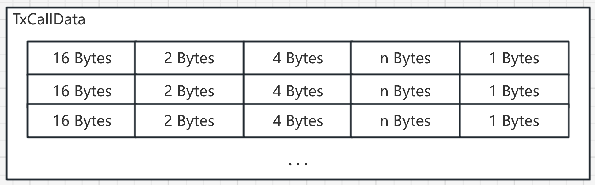
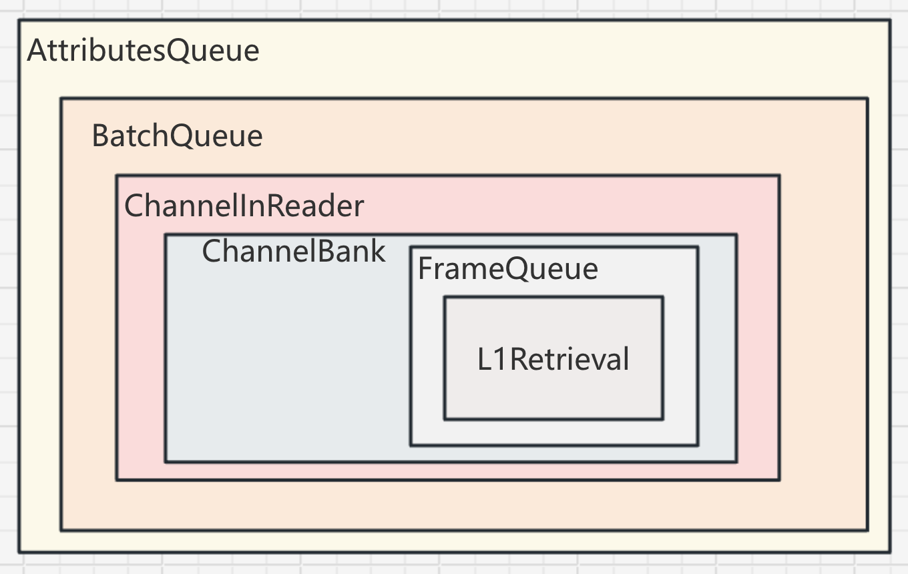

# Optimism L2 源码系列 - 还原交易

从 L1 上取回的数据是不能直接转换成 L2 的区块数据的，而是需要使用特定的方式拼接、解压并且解码之后，恢复成一些区块的元数据包，OP 把这些包称为 Batch，这些 Batch 每个都仅包含生成新区块必要的交易信息和其他供共识客户端验证状态的数据。

把这些从 L1 取回的数据恢复成可以让执行层执行的交易数据的过程都在 op-node 的 rollup/derive 包下的代码实现。其中有比较重要的 4 个基础数据结构体，分别是：Frame、Channel、SpanBatch 以及 SingularBatch。

其中最基础的数据结构体是 Frame，Channel 由多个 Frame 组成，当一个 Channel 收集到所有的 Frame 之后，会把 Frame 中包含的数据拼接起来，经过解压缩和 rlp 解码之后，得到原始的 Batch 数据。

# Frame 结构体

L1 取回的 calldata 数据，它实际上是由一个个小的数据结构组成的数组，这些小的数据结构被称为 Frame。

```go
type Frame struct {
    ID          ChannelID `json:"id"`
    FrameNumber uint16    `json:"frame_number"`
    Data        []byte    `json:"data"`
    IsLast      bool      `json:"is_last"`
}
```

有四个字段属性: ID、FrameNumber、Data、IsLast。

- ID：标识 Frame 归属的 Channel。
- FrameNumber: 同一个 Channel 中，数据会被拆分成多个 Frame，这些 Frame 是有序的，使用 FrameNumber 标记顺序，从 0 开始，并且不会出现空缺。
- Data：Frame 中实际存储数据的字段。
- IsLast：标识 Frame 是否是当前 Channel 中最后一个 Frame。

calldata 解析成 Frame 的过程：

```go
func ParseFrames(data []byte) ([]Frame, error) {
    if len(data) == 0 {
       return nil, errors.New("data array must not be empty")
    }
    if data[0] != _DerivationVersion0 _{
       return nil, fmt.Errorf("invalid derivation format byte: got %d", data[0])
    }
    buf := bytes.NewBuffer(data[1:])
    var frames []Frame
    for buf.Len() > 0 {
       var f Frame
       if err := f.UnmarshalBinary(buf); err != nil {
          return nil, fmt.Errorf("parsing frame %d: %w", len(frames), err)
       }
       frames = append(frames, f)
    }
    if buf.Len() != 0 {
       return nil, fmt.Errorf("did not fully consume data: have %d frames and %d bytes left", len(frames), buf.Len())
    }
    if len(frames) == 0 {
       return nil, errors.New("was not able to find any frames")
    }
    return frames, nil
}
```

首先会交易的 calldata 会被转成[]byte。

先检查第一个字节是否为预期的标识符版本号 `DerivationVersion0`，截去第一个字节后创建一个 `bytes.Buffer`。

在循环中，反复逐个字节读取 buffer 中的数据，按照特定的读取 byte，并解析之后，创建 `Frame` 实例，放入 `[]Frame`,如果 buf 在 for 循环之后还有多余的字节，会直接返回错误，表示解析失败。

最后返回一个 Frame 列表。

而 Frame 具体的反序列化过程可以看 `Frame` 结构体的 `UnmarshalBinary` 方法：

```go
func (f *Frame) UnmarshalBinary(r ByteReader) error {
    if _, err := io.ReadFull(r, f.ID[:]); err != nil {
       // Forward io.EOF here ok, would mean not a single byte from r.
       return fmt.Errorf("reading channel_id: %w", err)
    }
    if err := binary.Read(r, binary.BigEndian, &f.FrameNumber); err != nil {
       return fmt.Errorf("reading frame_number: %w", eofAsUnexpectedMissing(err))
    }

    var frameLength uint32
    if err := binary.Read(r, binary.BigEndian, &frameLength); err != nil {
       return fmt.Errorf("reading frame_data_length: %w", eofAsUnexpectedMissing(err))
    }

    // Cap frame length to MaxFrameLen (currently 1MB)
    if frameLength > _MaxFrameLen _{
       return fmt.Errorf("frame_data_length is too large: %d", frameLength)
    }
    f.Data = make([]byte, int(frameLength))
    if _, err := io.ReadFull(r, f.Data); err != nil {
       return fmt.Errorf("reading frame_data: %w", eofAsUnexpectedMissing(err))
    }

    if isLastByte, err := r.ReadByte(); err != nil {
       return fmt.Errorf("reading final byte (is_last): %w", eofAsUnexpectedMissing(err))
    } else if isLastByte == 0 {
       f.IsLast = false
    } else if isLastByte == 1 {
       f.IsLast = true
    } else {
       return errors.New("invalid byte as is_last")
    }
    return nil
}
```

会先后从 buf 中读取 16 位 byte 作为 ChannelID；读取 2 位 byte 转换成 uint16 赋值给 FrameNumber；读取 4 位 byte 转换成 uint32，赋值给变量 frameLength；读取 frameLength 长度的 byte 的 Data；最后读取一位 byte，根据 byte 的值判断是否是最后一个 Frame。

calldata 或 blobdata 中保存的 Frame 的结构示意图：



这些被处理好的 Frame 列表会被添加到 `FrameQueue` 的实例中。

# Channel 结构体

Channel 实例是用来管理 Frame 的，保证数据的顺序性和完整性。

```go
type Channel struct {
    id        ChannelID
    openBlock eth.L1BlockRef
    size uint64
    closed bool
    highestFrameNumber uint16
    endFrameNumber uint16
    inputs map[uint64]Frame
    highestL1InclusionBlock eth.L1BlockRef
}
```

- Id：当前 Channel 的唯一标识。
- openBlock：创建 Channel 实例时同步进度的 L1 区块信息。
- size：已经保存的所有的 Frame 的 data 长度的和。
- closed：当 Channel 收到 `IsLast == true` 的 Frame 时，就立刻修改这个字段为 true，同时还会初始化 endFrameNumber 的值。
- highestFrameNumber：记录当前已添加的 Frame 中最大的 FrameNumber。
- endFrameNumber：记录 `IsLast == true` 的 Frame 的 FrameNumber。
- inputs：添加的 Frame 示例都会被保存到这个 map 集合中。
- highestL1InclusionBlock：Frame 数据可能是从不同的 L1 区块中取出的，记录最大 L1 区块。

往 Channel 实例添加 Frame 需要调用 `AddFrame()` 方法:

```go
func (ch *Channel) AddFrame(frame Frame, l1InclusionBlock eth.L1BlockRef) error {
    if frame.ID != ch.id {
       return fmt.Errorf("frame id does not match channel id. Expected %v, got %v", ch.id, frame.ID)
    }
    // These checks are specified and cannot be changed without a hard fork.
    if frame.IsLast && ch.closed {
       return fmt.Errorf("cannot add ending frame to a closed channel. id %v", ch.id)
    }
    if _, ok := ch.inputs[uint64(frame.FrameNumber)]; ok {
       return DuplicateErr
    }
    if ch.closed && frame.FrameNumber >= ch.endFrameNumber {
       return fmt.Errorf("frame number (%d) is greater than or equal to end frame number (%d) of a closed channel", frame.FrameNumber, ch.endFrameNumber)
    }

    // Guaranteed to succeed. Now update internal state
    if frame.IsLast {
       ch.endFrameNumber = frame.FrameNumber
       ch.closed = true
    }
    // Prune frames with a number higher than the closing frame number when we receive a closing frame
    if frame.IsLast && ch.endFrameNumber < ch.highestFrameNumber {
       // Do a linear scan over saved inputs instead of ranging over ID numbers
       for id, prunedFrame := range ch.inputs {
          if id >= uint64(ch.endFrameNumber) {
             delete(ch.inputs, id)
          }
          ch.size -= frameSize(prunedFrame)
       }
       ch.highestFrameNumber = ch.endFrameNumber
    }
    // Update highest seen frame number after pruning
    if frame.FrameNumber > ch.highestFrameNumber {
       ch.highestFrameNumber = frame.FrameNumber
    }

    if ch.highestL1InclusionBlock.Number < l1InclusionBlock.Number {
       ch.highestL1InclusionBlock = l1InclusionBlock
    }
    ch.inputs[uint64(frame.FrameNumber)] = frame
    ch.size += frameSize(frame)

    return nil
}
```

所有的 Frame 都会按照 ChannelID 添加到对应的 Channel 实例中，每个 Frame 被添加的 Channel 实例中时，还需要经过一些状态检查，主要目的都是为了过滤重复数据。

当 Channel 收到所有的 Frame 之后，会把这些 Frame 按照顺序合并成一个 MultiReader:

```go
func (ch *Channel) Reader() io.Reader {
    var readers []io.Reader
    for i := uint64(0); i <= uint64(ch.endFrameNumber); i++ {
       frame, ok := ch.inputs[i]
       if !ok {
          panic("dev error in channel.Reader. Must be called after the channel is ready.")
       }
       readers = append(readers, bytes.NewReader(frame.Data))
    }
    return io.MultiReader(readers...)
}
```

使用这个 MultiReader 可以把所有的 Frame 中的 data 合并到一个[]byte 中，最终返回给 ChannelInReader 实例，在 WriteChannel 方法中被处理：

```go
func (cr *ChannelInReader) WriteChannel(data []byte) error {
    if f, err := BatchReader(bytes.NewBuffer(data), cr.spec.MaxRLPBytesPerChannel(cr.prev.Origin().Time), cr.cfg.IsFjord(cr.prev.Origin().Time)); err == nil {
       cr.nextBatchFn = f
       cr.metrics.RecordChannelInputBytes(len(data))
       return nil
    } else {
       cr.log.Error("Error creating batch reader from channel data", "err", err)
       return err
    }
}
```

这个方法的主要逻辑在 BatchReader 方法中：

```go
func BatchReader(r io.Reader, maxRLPBytesPerChannel uint64, isFjord bool) (func() (*BatchData, error), error) {
    // use buffered reader so can peek the first byte
    bufReader := bufio.NewReader(r)
    compressionType, err := bufReader.Peek(1)
    if err != nil {
       return nil, err
    }

    var zr io.Reader
    var comprAlgo CompressionAlgo
    if compressionType[0]&0x0F == _ZlibCM8 _|| compressionType[0]&0x0F == _ZlibCM15 _{
       var err error
       zr, err = zlib.NewReader(bufReader)
       // 省略一些分支判断
       comprAlgo = _Zlib_
_    _} else if compressionType[0] == _ChannelVersionBrotli _{
       // 省略一些分支判断
       zr = brotli.NewReader(bufReader)
       comprAlgo = _Brotli_
_    _} else {
       return nil, fmt.Errorf("cannot distinguish the compression algo used given type byte %v", compressionType[0])
    }

    // Setup decompressor stage + RLP reader
    rlpReader := rlp.NewStream(zr, maxRLPBytesPerChannel)
    // Read each batch iteratively
    return func() (*BatchData, error) {
       batchData := BatchData{ComprAlgo: comprAlgo}
       if err := rlpReader.Decode(&batchData); err != nil {
          return nil, err
       }
       return &batchData, nil
    }, nil
}
```

BatchReader 方法会把聚合的数据，根据压缩标识符，选择不同的解压方式，创建解压 Reader 实例，再把解压 reader 作为数据源，创建 rlpReader 实例。

读取数据的操作作为闭包返回，赋值给 ChannelInReader 实例的 nextBatchFn 字段。

# 解码 SpanBatch

当读取下一个 Batch 数据时，使用 ChannelInReader 实例的 nextBatchFn 的函数变量，执行 nextBatchFn 函数，会执行 BatchData 的 rlp 解码方法：

```go
func (b *BatchData) DecodeRLP(s *rlp.Stream) error {
    if b == nil {
       return errors.New("cannot decode into nil BatchData")
    }
    v, err := s.Bytes()
    if err != nil {
       return err
    }
    return b.decodeTyped(v)
}

func (b *BatchData) decodeTyped(data []byte) error {
    if len(data) == 0 {
       return errors.New("batch too short")
    }
    var inner InnerBatchData
    switch data[0] {
    case _SingularBatchType_:
       inner = new(SingularBatch)
    case _SpanBatchType_:
       inner = new(RawSpanBatch)
    default:
       return fmt.Errorf("unrecognized batch type: %d", data[0])
    }
    if err := inner.decode(bytes.NewReader(data[1:])); err != nil {
       return err
    }
    b.inner = inner
    return nil
}
```

会根据先根据首个 byte 的值，决定 Batch 的类型是 SingularBatch 类型还是 SpanBatch 类型。

如果是 SingularBatch 类型，非常简单，会创建一个 SingularBatch 实例，并且根据 rlp 编码规范，在解码时，逐个字段按照声明书序赋值：

```go
type SingularBatch struct {
    ParentHash   common.Hash
    EpochNum     rollup.Epoch
    EpochHash    common.Hash
    Timestamp    uint64
    Transactions []hexutil.Bytes
}
```

- ParentHash：上一个 L2 区块的区块 Hash，占用 32 个 byte。
- EpochNum：关联的 L1 区块高度， 占用 8 个字节。
- EpochHash：epochNum 代表的区块的区块 Hash， 占用 32 个 byte。
- Timestamp：当前 Batch 数据代表的 L2 区块的区块时间，占用 8 个 byte。
- Transactions：L2 区块中包含的交易列表，占用的数据长度不确定。

如果是 SpanBatch 类型，需要先反序列化成 RawSpanBatch 实例，RawSpanBatch 类型以及嵌套结构体:

```go
type spanBatchPrefix struct {
    relTimestamp  uint64   // Relative timestamp of the first block
    l1OriginNum   uint64   // L1 origin number
    parentCheck   [20]byte // First 20 bytes of the first block's parent hash
    l1OriginCheck [20]byte // First 20 bytes of the last block's L1 origin hash
}

type spanBatchPayload struct {
    blockCount    uint64        // Number of L2 block in the span
    originBits    *big.Int      // Standard span-batch bitlist of blockCount bits. Each bit indicates if the L1 origin is changed at the L2 block.
    blockTxCounts []uint64      // List of transaction counts for each L2 block
    txs           *spanBatchTxs // Transactions encoded in SpanBatch specs
}

type spanBatchTxs struct {
    // this field must be manually set
    totalBlockTxCount uint64

    // 8 fields
    contractCreationBits *big.Int // standard span-batch bitlist
    yParityBits          *big.Int // standard span-batch bitlist
    txSigs               []spanBatchSignature
    txNonces             []uint64
    txGases              []uint64
    txTos                []common.Address
    txDatas              []hexutil.Bytes
    protectedBits        *big.Int // standard span-batch bitlist

    // intermediate variables which can be recovered
    txTypes            []int
    totalLegacyTxCount uint64
}

// RawSpanBatch is another representation of SpanBatch, that encodes data according to SpanBatch specs.
type RawSpanBatch struct {
    spanBatchPrefix
    spanBatchPayload
}
```

SpanBatch 是由一堆区块聚合而成的，并且省略了一部分 L2 的元数据，最终这些保留的数据就是最重要的数据，被分成了两部分，分别是 `spanBatchPrefix` 和 `spanBatchPayload`。

`spanBatchPrefix` 结构体中字段说明：

- relTimestamp：L2 genesis 区块时间 + relTimestamp 就是 spanBatch 中包含的这批区块当中，最小区块高度的区块时间。
- l1OriginNum：关联的 L1 的区块高度。
- parentCheck：这批区块当中，起始的 L2 区块 Hash，校验数据时，判断执行层客户端最新的区块 Hash 是否与这个字段的 Hash 值相同。
- l1OriginCheck：关联的 L1 区块 Hash。

spanBatchPayload 结构体，包含实际交易数据的部分，字段说明：

- blockCount：当前 SpanBatch 包含的 L2 的区块数据总量。
- originBits：标识 L1 origin 发生变化的位图信息，是由 blockCount 个位的 bit 组成的数字，如果某一位等于 1，标识在那个区块时，L1 Origin 发生了变化。
- blockTxCounts：不同 L2 区块中，包含的交易数。
- txs：所有区块中包含的交易信息，同一个交易的属性都保存在各种数组字段中相同下标的位置。

RawSpanBatch 只是 SpanBatch 原始数据，还需要经过 `DeriveSpanBatch` 方法的处理，参数是基础的 L2 的链配置，出块时间、L2 genesis 区块时间以及链 Id：

```go
func DeriveSpanBatch(batchData *BatchData, blockTime, genesisTimestamp uint64, chainID *big.Int) (*SpanBatch, error) {
    rawSpanBatch, ok := batchData.inner.(*RawSpanBatch)
    if !ok {
       return nil, NewCriticalError(errors.New("failed type assertion to SpanBatch"))
    }
    // If the batch type is Span batch, derive block inputs from RawSpanBatch.
    return rawSpanBatch.ToSpanBatch(blockTime, genesisTimestamp, chainID)
}

func (b *RawSpanBatch) ToSpanBatch(blockTime, genesisTimestamp uint64, chainID *big.Int) (*SpanBatch, error) {
    spanBatch, err := b.derive(blockTime, genesisTimestamp, chainID)
    if err != nil {
       return nil, err
    }
    return spanBatch, nil
}

func (b *RawSpanBatch) derive(blockTime, genesisTimestamp uint64, chainID *big.Int) (*SpanBatch, error) {
    if b.blockCount == 0 {
       return nil, ErrEmptySpanBatch
    }
    blockOriginNums := make([]uint64, b.blockCount)
    l1OriginBlockNumber := b.l1OriginNum
    for i := int(b.blockCount) - 1; i >= 0; i-- {
       blockOriginNums[i] = l1OriginBlockNumber
       if b.originBits.Bit(i) == 1 && i > 0 {
          l1OriginBlockNumber--
       }
    }

    if err := b.txs.recoverV(chainID); err != nil {
       return nil, err
    }
    fullTxs, err := b.txs.fullTxs(chainID)
    if err != nil {
       return nil, err
    }

    spanBatch := SpanBatch{
       ParentCheck:   b.parentCheck,
       L1OriginCheck: b.l1OriginCheck,
    }
    txIdx := 0
    for i := 0; i < int(b.blockCount); i++ {
       batch := SpanBatchElement{}
       batch.Timestamp = genesisTimestamp + b.relTimestamp + blockTime*uint64(i)
       batch.EpochNum = rollup.Epoch(blockOriginNums[i])
       for j := 0; j < int(b.blockTxCounts[i]); j++ {
          batch.Transactions = append(batch.Transactions, fullTxs[txIdx])
          txIdx++
       }
       spanBatch.Batches = append(spanBatch.Batches, &batch)
    }
    return &spanBatch, nil
}
```

最终会在 `derive()` 方法中，把 RawSpanBatch 聚合在一起的区块交易拆分出来，创建 SpanBatchElement 实例来保存各个区块中的 L1 Origin 信息、L2 的区块时间和 L2 区块中的交易。

会调用 BatchQueue 的 AddBatch 方法把解析好的 SpanBatch 和 SingularBatch 实例添加到 BatchQueue 实例中。

添加到 BatchQueue 实例后，调用 `deriveNextBatch()` 方法。

在该方法中调用 `CheckBatch()` 方法，保证 Batch 数据的有效性，过滤掉重复数据、历史数据以及错误数据。

如果 Batch 的时间与本地的执行层客户端的最新 L2 区块时间相差为 2，则这个 Batch 就是接下来需要处理的，`CheckBatch()` 返回的结果是_BatchAccept_。

如果找到合适的 Batch，`deriveNextBatch()` 方法会立刻返回，并且处理这个 Batch，根据 Batch 的类型，如果是 SingularBatch 类型无需任何处理，如果是 SpanBatch 类型，还需要把 SpanBatch 转换成 SingularBatch 列表：

```go
var nextBatch *SingularBatch
switch typ := batch.GetBatchType(); typ {
case _SingularBatchType_:
    singularBatch, ok := batch.AsSingularBatch()
    if !ok {
       return nil, false, NewCriticalError(errors.New("failed type assertion to SingularBatch"))
    }
    nextBatch = singularBatch
case _SpanBatchType_:
    spanBatch, ok := batch.AsSpanBatch()
    if !ok {
       return nil, false, NewCriticalError(errors.New("failed type assertion to SpanBatch"))
    }
    // If next batch is SpanBatch, convert it to SingularBatches.
    singularBatches, err := spanBatch.GetSingularBatches(bq.l1Blocks, parent)
    if err != nil {
       return nil, false, NewCriticalError(err)
    }
    bq.nextSpan = singularBatches
    // span-batches are non-empty, so the below pop is safe.
    nextBatch = bq.popNextBatch(parent)
default:
    return nil, false, NewCriticalError(fmt.Errorf("unrecognized batch type: %d", typ))
}
```

会在 `GetSingularBatches()` 把 SpanBatch 转成 SingularBatch 列表：

```go
func (b *SpanBatch) GetSingularBatches(l1Origins []eth.L1BlockRef, l2SafeHead eth.L2BlockRef) ([]*SingularBatch, error) {
    var singularBatches []*SingularBatch
    originIdx := 0
    for _, batch := range b.Batches {
       if batch.Timestamp <= l2SafeHead.Time {
          continue
       }
       singularBatch := SingularBatch{
          EpochNum:     batch.EpochNum,
          Timestamp:    batch.Timestamp,
          Transactions: batch.Transactions,
       }
       originFound := false
       for i := originIdx; i < len(l1Origins); i++ {
          if l1Origins[i].Number == uint64(batch.EpochNum) {
             originIdx = i
             singularBatch.EpochHash = l1Origins[i].Hash
             originFound = true
             break
          }
       }
       if !originFound {
          return nil, fmt.Errorf("unable to find L1 origin for the epoch number: %d", batch.EpochNum)
       }
       singularBatches = append(singularBatches, &singularBatch)
    }
    return singularBatches, nil
}
```

遍历 SpanBatch 中的 SpanBatchElement 列表。

在循环中，把时间小于当前 L2SafeHead 区块时间的 SpanBatchElement 过滤掉。

创建一个新的 SingularBatch 实例，把 SpanBatchElement 中几个字段的值作为初始化参数赋值给 SingularBatch。

还需要用 EpochNum 在参数 l1Origins 列表中遍历查找 L1 区块信息，如果找到了，把 L1 区块的 Hash 信息赋值给 SingularBatch 的 EpochHash 字段。否则会返回异常。

如果 SpanBatch 中所有的数据均有效的情况下，SpanBatch 中有多少个区块，在这里就会有多少个 SingularBatch 的实例。

也就是说每个 SingularBatch 都对应着一个 L2 的区块。

这时 SpanBatch 中的 SingularBatch 列表中，所有 SingularBatch 实例有一个字段没有被初始化，就是 ParentHash，而 ParentHash 会在获取 Batch 时使用当前本地的执行层客户端的最新 L2 区块信息中的 Hash 作为 ParentHash：

```go
func (bq *BatchQueue) popNextBatch(parent eth.L2BlockRef) *SingularBatch {
    if len(bq.nextSpan) == 0 {
       panic("popping non-existent span-batch, invalid state")
    }
    nextBatch := bq.nextSpan[0]
    bq.nextSpan = bq.nextSpan[1:]
    // Must set ParentHash before return. we can use parent because the parentCheck is verified in CheckBatch().
    nextBatch.ParentHash = parent.Hash
    bq.log.Debug("pop next batch from the cached span batch")
    return nextBatch
}
```

# 解析过程组件



解码过程中有多个组件参与，这些组件构成类似责任链模式，不同环节分工不同。

从内到外分别是：

- L1Retrieval：从 L1 的执行层客户端节点拉取数据。
- FrameQueue：处理 L1Retrieval 返回的交易数据，将交易的 calldata 或者 blobdata 反序列化成 Frame 列表，并保存。
- ChannelBank：从 FrameQueue 读取 Frame，并将返回的 Frame 根据 ChannelID 分别创建不同的 Channel 实例，添加到 Channel 中。如果有 Channel 收到了完整的 Frame 数据，会把这些 Frame 数据聚合起来，返回给上层。
- ChannelInReader：从 ChannelBank 中获取一个 channel 中完整的数据。并把数据反序列化成 SingularBatch 或者 SpanBatch。
- BatchQueue：从 ChannelInReader 获取 Batch 数据，Batch 可能是 SingularBatch 或者 SpanBatch，SingularBatch 经过检查后会缓存到自己的 Batches 列表中，如果是 SpanBatch，在经过检查之后，同样会保存到自己的 Batches 列表中，但是，当需要使用时，SpanBatch 需要先转换成 SingularBatch 列表，然后按照先后顺序，返回一个 SingularBatch。
- AttributeQueue：会把 Batch 数据转换成 `PayloadAttributes`，并添加 deposit 交易，并根据区块时间，添加 hardfork 升级所需预部署合约交易和其他升级所的交易。

# SpanBatch 如何节约空间

Optimism 使用 SpanBatch 的原因就是 SpanBatch 的信息密度更高，L2 上的每笔交易在 L1 上消耗的 gas 费用会更低。

它节约空间的地方在于以下几个方面：

1. 更少的 Hash，SingularBatch 中，都会包含 L1 EpochHash 和 L2 ParentHash，而 SpanBatch 仅保存了一批 Batch 中第一个 Batch 的 L1 EpochHash 和 L2 ParentHash 用于校验，其余都是使用 Number 和最新的 L2 区块信息补全。
2. 更小的时间戳，SingularBatch 中，会保存完整的区块时间戳信息，而 SpanBatch 则只保留了一批 Batch 中，第一个 Batch 的时间戳，并且为了数字更小，还把时间戳与 L2 的 genesis 时间作差，计算得到 relTimestamp，其他 Batch 根据顺序，使用 genesisTime + relTimestamp + BlockTime * i，获得完整的时间戳。
3. 空块更节省空间，SingularBatch 中即使没有交易数据，依然有 L1 EpochHash、L1 EpochNum、L2 ParentHash、L2 Timestamp，这些字段编码后，至少要占用 80 个 byte。但是 SpanBatch 中，单个空块编码不占优势，但是如果 Batch 数量多，空块甚至几乎不占用任何数据空间，只占用几个位图的 bit。
