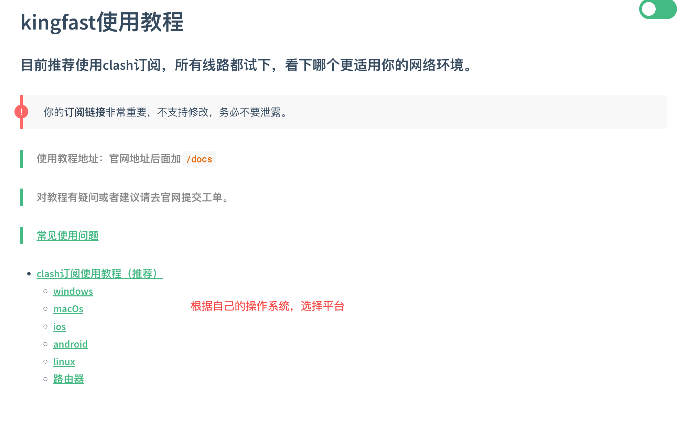

# MetaMask钱包使用

[📺 学习视频](https://k22zz.xetslk.com/s/8tEKq)

MetaMask是一个流行的以太坊钱包，支持浏览器扩展和移动应用。本教程将指导您如何安装、配置和使用MetaMask钱包。

## 1. 环境准备
> 确保能够「科学上网」，推荐代理软件安装地址 ➡️ [clash verge](https://kingfast.info/docs/#/)

然后购买订阅的话，可以到 [ikuuu](https://ikuuu.de/auth/login) 注册一个账号，购买一个免费的

## 2. 安装MetaMask

### 2.1 浏览器扩展安装
1. 访问 [MetaMask官网](https://metamask.io/)
2. 点击"Download"按钮
3. 选择您的浏览器（Chrome、Firefox、Edge等）
4. 在浏览器扩展商店中点击"添加至Chrome"（或相应浏览器）
5. 确认安装

### 2.2 移动端安装
1. 在App Store或Google Play搜索"MetaMask"
2. 下载并安装应用

## 3. 创建钱包

### 3.1 首次设置
1. 打开MetaMask扩展或应用
2. 点击"创建钱包"
3. 阅读并同意服务条款
4. 创建密码（至少8位字符）
5. 观看安全视频（可选但推荐）

### 3.2 备份助记词
1. 系统会生成12个助记词
2. **重要**：按顺序记录这些助记词
3. 将助记词存储在安全的地方（离线存储）
4. 确认助记词顺序

## 4. 钱包界面介绍

### 4.1 主界面功能
- **账户余额**：显示ETH和其他代币余额
- **发送**：转账功能
- **接收**：显示钱包地址和二维码
- **交易历史**：查看所有交易记录

### 4.2 网络切换
- 主网（Mainnet）：真实的以太坊网络
- 测试网（Testnet）：用于测试，如X Layer测试网、Sepolia
- 自定义网络：添加其他区块链网络

## 5. 添加网络

### 5.1 添加测试网络
1. 点击网络下拉菜单
2. 选择"显示测试网络"
3. 选择X Layer或Sepolia测试网

### 5.2 添加自定义网络
1. 点击"添加网络"
2. 填写网络信息：
   - 网络名称
   - RPC URL
   - 链ID
   - 货币符号
   - 区块浏览器URL

## 6. 获取测试币

### 6.1 X Layer测试网
[📺 教程视频](https://k22zz.xetslk.com/s/1NE36c)
1. 切换到X Layer测试网
2. 访问 [X Layer水龙头](https://web3.okx.com/zh-hans/xlayer/faucet/xlayerfaucet)
3. 输入钱包地址
4. 完成验证码
5. 等待测试币到账

### 6.2 Sepolia测试网
1. 切换到Sepolia网络
2. 访问 [Sepolia水龙头](https://sepoliafaucet.com/)
3. 连接钱包或输入地址
4. 获取测试币

## 7. 发送和接收代币

### 7.1 发送代币
1. 点击"发送"按钮
2. 输入接收地址
3. 选择代币类型
4. 输入数量
5. 设置Gas费用
6. 确认交易

### 7.2 接收代币
1. 点击"接收"按钮
2. 复制钱包地址
3. 发送给付款方
4. 或展示二维码供扫描

## 8. 安全注意事项

### 8.1 助记词安全
- 永远不要在线存储助记词
- 不要截图或拍照保存
- 使用硬件钱包备份
- 不要分享给任何人

### 8.2 钓鱼网站防范
- 只从官方渠道下载MetaMask
- 检查网站URL是否正确
- 不要在不信任的网站输入助记词
- 使用硬件钱包进行大额交易

### 8.3 交易安全
- 仔细检查接收地址
- 设置合理的Gas费用
- 小额测试后再进行大额交易
- 定期备份钱包

## 9. 常见问题

### 9.1 交易失败
- 检查Gas费用是否足够
- 确认网络连接正常
- 检查账户余额是否充足

### 9.2 代币不显示
- 手动添加代币合约地址
- 检查网络是否正确
- 刷新页面或重启扩展

### 9.3 忘记密码
- 使用助记词重新导入钱包
- 密码无法恢复，只能重置

## 10. 高级功能

### 10.1 连接DApp
1. 访问支持MetaMask的DApp
2. 点击"连接钱包"
3. 授权连接请求
4. 开始使用DApp功能

### 10.2 硬件钱包集成
1. 购买硬件钱包（Ledger、Trezor等）
2. 在MetaMask中连接硬件钱包
3. 享受更高的安全性

## 11. 总结

MetaMask是进入Web3世界的重要工具，掌握其使用方法对区块链开发至关重要。记住：
- 安全第一，保护好助记词
- 先在测试网练习
- 小额测试，逐步熟悉
- 保持软件更新

下一步，我们将学习如何发行自己的代币！
